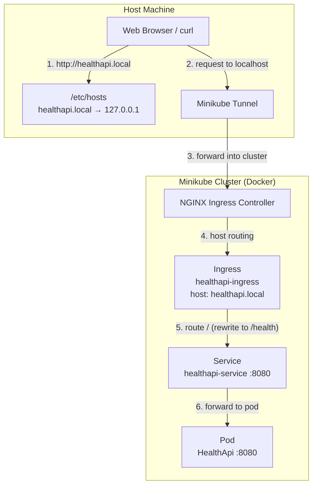

# Health API on Kubernetes with Minikube

[](https://dotnet.microsoft.com/)
[](https://www.gnu.org/software/bash/)
[](https://www.docker.com/)
[](https://kubernetes.io/)
[](https://helm.sh/)
[](https://minikube.sigs.k8s.io/)

.NET 8 Docker Kubernetes Minikube NGINX Ingress

This project deploys a simple **.NET 8** minimal API called **HealthApi** on a local Kubernetes cluster using **Minikube**.  
It follows a DevOps-style local workflow: **build a Docker image**, **load it into Minikube** (because Minikube nodes may not see your local images), deploy with **Kubernetes manifests**, and expose it via **NGINX Ingress** at `http://healthapi.local`.

Key points:

- **Minikube cluster**: Docker driver + **2 nodes**
- **App**: .NET 8 minimal API
- **Endpoint**: `GET /health` returns JSON
- **Port**: `8080`
- **Scripts**: `scripts/` includes optional install/uninstall automation for macOS/Linux
- **Ingress**: routes `healthapi.local` to the service and rewrites `/` → `/health`

---

## Contents

- [Project Purpose](#project-purpose)
- [What is this API?](#what-is-this-api)
- [Prerequisites](#prerequisites)
- [Prerequisites Installation](#prerequisites-installation)
  - [1) .NET 8 SDK (macOS)](#1-net-8-sdk-macos)
  - [2) Docker](#2-docker)
  - [3) kubectl (macOS)](#3-kubectl-macos)
  - [4) Minikube (macOS)](#4-minikube-macos)
  - [5) Helm (macOS)](#5-helm-macos)
- [Step-by-Step Deployment](#step-by-step-deployment)
  - [Step 1: Clone the repository](#step-1-clone-the-repository)
  - [Step 2: Create the .NET project (HealthApi)](#step-2-create-the-net-project-healthapi)
  - [Step 3: Update `Program.cs`](#step-3-update-programcs)
  - [Step 4: Create the Dockerfile](#step-4-create-the-dockerfile)
  - [Step 5: Create a Minikube cluster (Docker driver, 2 nodes)](#step-5-create-a-minikube-cluster-docker-driver-2-nodes)
  - [Step 6: Build the Docker image and load it into Minikube](#step-6-build-the-docker-image-and-load-it-into-minikube)
  - [Step 7: Enable Ingress addon](#step-7-enable-ingress-addon)
  - [Step 8: Add local host entry](#step-8-add-local-host-entry)
  - [Step 9: Start Minikube tunnel](#step-9-start-minikube-tunnel)
  - [Step 10: Deploy Kubernetes manifests](#step-10-deploy-kubernetes-manifests)
  - [Step 11: Verify and access the app](#step-11-verify-and-access-the-app)
- [Deploy with Helm](#deploy-with-helm)
- [Optional scripts](#optional-scripts)
- [GitLab CI/CD (Optional)](#gitlab-cicd-optional)
- [Project improvements](#project-improvements)
- [Troubleshooting](#troubleshooting)
- [Cleanup & Removing Resources](#cleanup--removing-resources)
- [Project Structure](#project-structure)
- [Kubernetes Objects Used](#kubernetes-objects-used)
- [System Architecture Overview](#system-architecture-overview)

---

## Project Purpose

The goal of this project is to provide a **complete, reproducible local Kubernetes deployment** for a tiny .NET service.

You will learn how to:

- Create a **.NET 8 minimal API**
- Containerize it with a **multi-stage Dockerfile**
- Run a **2-node Minikube cluster** using the Docker driver
- Make a locally built image available inside Minikube using **`minikube image load`**
- Expose the app via **Ingress** and access it using a local domain (`healthapi.local`)

---

## What is this API?

The application exposes a single health endpoint:

- `GET /health`

It returns a JSON response like:

```json
{
  "status": "ok",
  "version": "1.0.0"
}
```

The app listens on port **8080** and binds to `0.0.0.0` so it is reachable from inside the container/Kubernetes network.

---

## Prerequisites

Before starting, ensure you have **administrator/root privileges** where needed (e.g., Docker, Minikube, running `minikube tunnel`, or editing `/etc/hosts`).

| Tool | Minimum Version | Purpose |
| --- | --- | --- |
| [Docker](https://www.docker.com/products/docker-desktop) | 20.10+ | Container runtime; Minikube uses Docker as driver |
| [kubectl](https://kubernetes.io/docs/tasks/tools/) | 1.24+ | Kubernetes CLI to manage the cluster |
| [Minikube](https://minikube.sigs.k8s.io/) | 1.35+ | Local Kubernetes cluster |
| [Helm](https://helm.sh/) | 3.0+ | Package manager for Kubernetes (Helm deployment path) |
| [.NET SDK 8](https://dotnet.microsoft.com/en-us/download/dotnet/8.0) | 8.x | Build the API and run it locally (optional) |
| [Git](https://git-scm.com/) | 2.x | Clone the repository |
| Web Browser / curl | - | Access the app at `http://healthapi.local` |

---

## Prerequisites Installation

### 1) .NET 8 SDK (macOS)

Install:

```bash
brew install --cask dotnet-sdk@8
```

Verify:

```bash
dotnet --version
```

### 2) Docker

Install Docker Desktop and ensure it is running.

Verify:

```bash
docker --version
docker run hello-world
```

### 3) kubectl (macOS)

```bash
brew install kubectl
kubectl version --client
```

### 4) Minikube (macOS)

```bash
brew install minikube
minikube version
```

### 5) Helm (macOS)

Install:

```bash
brew install helm
```

Verify:

```bash
helm version
```

---

## Step-by-Step Deployment

### Step 1: Clone the repository

```bash
git clone https://github.com/kadirariklar/healthapi-on-kubernetes.git
cd healthapi-on-kubernetes
```

> If you already have the project locally, just `cd` into the repo root.

### Optional scripts

This repository also includes optional automation scripts in the `scripts/` folder for macOS and Linux. These scripts are provided for convenience and are not required to use the project.

- `scripts/install-k8s.sh` — starts Minikube, builds the Docker image, loads it into the cluster, enables ingress, starts a tunnel, and deploys the app with the Kubernetes manifests.
- `scripts/install-helm.sh` — follows the same workflow and deploys the app with Helm instead of raw manifests.
- `scripts/uninstall.sh` — cleans up the Helm release or manifests, stops any running `minikube tunnel`, deletes all Minikube profiles, removes the host entry, and deletes the local Docker image.

How to run the scripts:

```bash
cd healthapi-on-kubernetes
chmod +x scripts/*.sh
./scripts/install-k8s.sh
```

or, for Helm deployment:

```bash
cd healthapi-on-kubernetes
chmod +x scripts/*.sh
./scripts/install-helm.sh
```

To clean up everything after use:

```bash
cd healthapi-on-kubernetes
./scripts/uninstall.sh
```

If the scripts prompt for `sudo`, enter your password. The installer scripts handle Minikube, ingress, and tunnel setup automatically, while the uninstall script removes Minikube profiles and DNS entries.

Use these scripts if you want a faster one-command setup and teardown path.

### Step 2: Create the .NET project (HealthApi)

This repo already contains the project under `HealthApi/`.  
If you want to recreate it from scratch:

```bash
dotnet new web -n HealthApi
cd HealthApi
```

### Step 3: Update `Program.cs`

The `Program.cs` used in this project:

```csharp
var builder = WebApplication.CreateBuilder(args);

var app = builder.Build();

app.MapGet("/health", () =>
    Results.Json(new
    {
        status = "ok",
        version = "1.0.0"
    })
);

app.Urls.Add("http://0.0.0.0:8080");

app.Run();
```

Why `0.0.0.0`?

- If you bind only to `localhost`, the app may not be reachable from outside the container/pod.
- Binding to `0.0.0.0` makes it accessible on the pod network interface.

### Step 4: Create the Dockerfile

This project uses a multi-stage Docker build:

- **Build stage**: restore + publish
- **Runtime stage**: run with `mcr.microsoft.com/dotnet/aspnet:8.0`

The image exposes port **8080**.

### Step 5: Create a Minikube cluster (Docker driver, 2 nodes)

From the repo root:

```bash
minikube start --driver=docker --nodes=2
minikube status
kubectl get nodes
```

Expected output example:

```text
NAME           STATUS   ROLES           AGE   VERSION
minikube       Ready    control-plane   1m    v1.35.x
minikube-m02   Ready    <none>          1m    v1.35.x
```

Make sure both nodes are **Ready** before proceeding.

### Step 6: Build the Docker image and load it into Minikube

Build the Docker image (repo root):

```bash
docker build -t healthapi:1.0 ./HealthApi
```

Load the image into Minikube:

```bash
minikube image load healthapi:1.0
```

Why is this step needed?

- When using Minikube with Docker driver, your local Docker images are not always directly visible to the Kubernetes nodes.
- If the image is not available in Minikube, pods may fail with `ImagePullBackOff` because Kubernetes will try to pull from a registry.

### Step 7: Enable Ingress addon

Enable NGINX Ingress addon:

```bash
minikube addons enable ingress
```

Verify the ingress controller is running:

```bash
kubectl get pods -n ingress-nginx
kubectl get ingressclass
```

You should see an `IngressClass` named `nginx`.

### Step 8: Add local host entry

Map the domain to localhost so your browser/curl can resolve it.

macOS / Linux:

```bash
sudo sh -c 'echo "127.0.0.1 healthapi.local" >> /etc/hosts'
```

Verify:

```bash
grep healthapi.local /etc/hosts
```

### Step 9: Start Minikube tunnel

Start the tunnel (keep it running):

```bash
sudo minikube tunnel &
```

> On some systems you may prefer running it in a dedicated terminal without `&` so you can see logs.

### Step 10: Deploy Kubernetes manifests

Apply the manifests:

```bash
kubectl apply -f k8s/deployment.yaml
kubectl apply -f k8s/service.yaml
kubectl apply -f k8s/ingress.yaml
```

Wait for the pod to become Ready:

```bash
kubectl wait --for=condition=Ready pod -l app=healthapi --timeout=120s
kubectl get pods,svc,ingress
```

### Step 11: Verify and access the app

Browser:

- `http://healthapi.local/`

CLI:

```bash
curl -i http://healthapi.local/
curl -i http://healthapi.local/health
```

Expected:

- `/health` returns the JSON payload.
- `/` also works because the Ingress includes a rewrite rule:
  - `nginx.ingress.kubernetes.io/rewrite-target: /health`

---

## Deploy with Helm

This repository also includes a Helm chart located at `helm/` (at the repo root, aligned with `k8s/`).

### Prerequisites for Helm deployment

Before deploying with Helm, make sure:

- You have Helm installed (`helm version`)
- Your Minikube cluster is running (2 nodes, Docker driver)
- Ingress addon is enabled (`minikube addons enable ingress`)
- `healthapi.local` exists in `/etc/hosts`
- `sudo minikube tunnel` is running

### Install/Upgrade the chart

From the repo root:

```bash
helm upgrade --install healthapi ./helm
```

Wait for resources to be ready:

```bash
kubectl rollout status deployment/healthapi-healthapi --timeout=120s
kubectl wait --for=condition=Ready pod -l app.kubernetes.io/instance=healthapi --timeout=120s
```

Verify resources:

```bash
kubectl get pods,svc,ingress
```

Inspect the release:

```bash
helm list
helm status healthapi
```

Access:

- `http://healthapi.local/`

### Upgrade example (image tag)

If you built and loaded a new local image tag, you can upgrade by overriding values:

```bash
helm upgrade --install healthapi ./helm --set image.tag=1.0
```

### Uninstall

```bash
helm uninstall healthapi
```

> Note: This chart uses the image defined in `helm/values.yaml` (defaults to `healthapi:1.0`).  
> For Minikube, you still need to build and load the image:
>
> - `docker build -t healthapi:1.0 ./HealthApi`
> - `minikube image load healthapi:1.0`

---

## GitLab CI/CD (Optional)

This repo includes a GitLab pipeline definition in `.gitlab-ci.yaml`.

What it does (high-level):

- **build**: restores and builds the .NET project
- **docker-build**: builds the Docker image inside GitLab CI using Docker-in-Docker
- **image-push**: logs into the GitLab Container Registry and pushes the image (only on `main/master`)
- **deploy**: applies Kubernetes manifests from `k8s/` (manual, only if a kubeconfig secret is provided)

Required GitLab CI variables (typical setup):

- **`CI_REGISTRY`, `CI_REGISTRY_USER`, `CI_REGISTRY_PASSWORD`**: provided by GitLab when using its registry
- **`KUBE_CONFIG_DATA`**: base64-encoded kubeconfig for the target cluster (used by the deploy job)

Notes:

- The current pipeline tags images as `healthapi:${CI_COMMIT_SHORT_SHA}`.
- For local Minikube usage you still need `minikube image load healthapi:1.0` as described above.

---

## Troubleshooting

### 1) `ImagePullBackOff`

**Cause**: Minikube cannot see your local image and tries to pull from a registry.  
**Fix**:

```bash
minikube image load healthapi:1.0
kubectl rollout restart deployment/healthapi-deployment
kubectl get pods
```

### 2) `404 Not Found` from nginx

**Cause**: Ingress rules or rewrite not matching, or service name/port mismatch.  
**Check**:

```bash
kubectl describe ingress healthapi-ingress
kubectl get svc healthapi-service -o yaml
kubectl get endpoints healthapi-service
```

### 3) `503 Service Temporarily Unavailable`

**Cause**: Pod not Ready, probes failing, or service has no endpoints.  
**Check**:

```bash
kubectl get pods
kubectl describe pod -l app=healthapi
kubectl get endpoints healthapi-service
```

### 4) `healthapi.local` does not resolve (NXDOMAIN)

**Cause**: Missing entry in `/etc/hosts`.  
**Fix**:

```bash
sudo sh -c 'echo "127.0.0.1 healthapi.local" >> /etc/hosts'
```

### 5) Connection refused / cannot reach `healthapi.local`

**Cause**: tunnel not running, ingress controller not ready, or Minikube not healthy.  
**Check**:

```bash
minikube status
kubectl get pods -n ingress-nginx
```

Then ensure `sudo minikube tunnel` is running.

---

## Cleanup & Removing Resources

Delete Kubernetes resources:

```bash
kubectl delete -f k8s/ingress.yaml --ignore-not-found
kubectl delete -f k8s/service.yaml --ignore-not-found
kubectl delete -f k8s/deployment.yaml --ignore-not-found
```

Stop/Delete Minikube:

```bash
minikube stop --all
minikube delete --all
```

Remove hosts entry (macOS):

```bash
sudo sed -i '' '/healthapi.local/d' /etc/hosts
```

---

## Project Structure

```text
.
├── .gitignore
├── .gitlab-ci.yaml
├── scripts/
│   ├── install-k8s.sh
│   ├── install-helm.sh
│   └── uninstall.sh
├── helm/
│   ├── Chart.yaml
│   ├── values.yaml
│   └── templates/
│       ├── _helpers.tpl
│       ├── deployment.yaml
│       ├── ingress.yaml
│       └── service.yaml
├── README.md
├── HealthApi/
│   ├── HealthApi.csproj
│   ├── Program.cs
│   └── Dockerfile
└── k8s/
    ├── deployment.yaml
    ├── ingress.yaml
    └── service.yaml
```

---

## Project improvements

This repository is a good starting point for a local Kubernetes deployment, but there are several directions to improve it:

- Add a production-ready deployment path with TLS-enabled ingress and a real container registry.
- Add a dedicated CI/CD pipeline that builds, scans, and publishes images automatically.
- Add more API endpoints, request validation, logging, and structured error responses.
- Add Kubernetes resource requests/limits, Horizontal Pod Autoscaling (HPA), and tighter security settings.
- Add unit/integration tests for the API and end-to-end checks for the deployment.

## Kubernetes Objects Used

| Object | Purpose |
| --- | --- |
| Deployment | Runs the HealthApi pod and defines probes |
| Service (ClusterIP) | Exposes the pod internally on port 8080 |
| Ingress | Routes `healthapi.local` traffic to the Service and rewrites `/` → `/health` |

---

## System Architecture Overview



